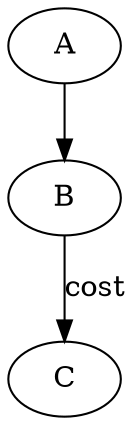

**Why DOT? A principled view**

The *DOT* language is the minimal, self‑describing grammar that turns a set of edges and nodes into an abstract graph, independent of any particular rendering engine.  
At its core it solves the problem: **“How do we encode a combinatorial structure so that different software can reconstruct the same topology without ambiguity?”**  

A graph \(G=(V,E)\) is defined by two finite sets. DOT gives each vertex a unique identifier and lists directed or undirected edges as pairs of those identifiers.  
The syntax:

encodes a directed graph with three vertices and two arcs, the second annotated with an attribute. The grammar is *context‑free*—any parser can build a parse tree, ensuring that every legal DOT file has a unique abstract syntax tree (AST).  

**Why it must be text‑based**

1. **Human readability** – the AST can be inspected or edited by hand, enabling rapid prototyping.  
2. **Version control friendliness** – diffs are meaningful; two files differ only where edges or attributes change.  
3. **Interoperability** – any language can emit or consume DOT because it is a plain text format with no binary dependencies.

**Deeper principle: declarative specification**

DOT embodies *declarativity*: you declare *what* the graph looks like, not *how* to draw it. Rendering engines (GraphViz, Cytoscape, etc.) take the AST and perform layout optimization (force‑directed, hierarchical, radial) to minimize crossings or edge lengths. This separation of concerns mirrors functional programming’s data vs. effect dichotomy.

**Non‑obvious insight**

DOT attributes are *key–value* pairs that can be inherited along subgraphs. A subtle but powerful feature is **attribute propagation**: defining `node [color=red]` at the top level makes every node red unless overridden, allowing global styling without repetition. Many users overlook this because they treat DOT as a raw edge list rather than a hierarchical style sheet.

_Written by openai/gpt-oss-20b running locally. Machine-generated, not reviewed._
