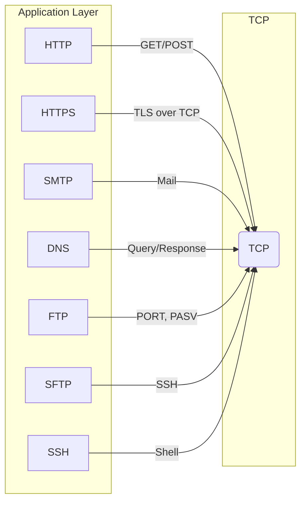

**Clarify**  
You want a single visual that maps **FTP** among the *eight* most‑used network protocols (HTTP, HTTPS, FTP, SFTP, SSH, SMTP, DNS, TCP/IP).  Confirm the list and whether you need protocol layers or just endpoints.

**Approach**  
1. Pick a two‑layer diagram: *Application Layer → Transport Layer*.  
2. List each protocol under its layer with an icon/label.  
3. Show the data flow arrow (client ↔ server) for each.  
4. Highlight FTP’s role (file transfer over TCP).

**Depth**  
- **Transport Layer** – TCP (reliable stream).  
- **Application Layer** –  
  - HTTP/HTTPS (web),  
  - SMTP (email),  
  - DNS (name resolution),  
  - FTP/SFTP (file),  
  - SSH (remote shell),  
  - Telnet (legacy remote access).  

**Edge Cases**  
- UDP‑based protocols (e.g., DNS over TLS) won’t appear.  
- File transfer via FTP requires a *control* and *data* channel; the diagram simplifies this.

**Optimize & Communicate**  
Add color coding: blue for HTTP/HTTPS, green for file protocols, orange for security (SSH/SFTP). Explain that FTP is the classic, unencrypted file protocol over TCP, whereas SFTP uses SSH for secure transfer. This visual lets interviewers instantly see how each protocol sits in the stack and where FTP fits.

_Written by openai/gpt-oss-20b running locally. Machine-generated, not reviewed._
