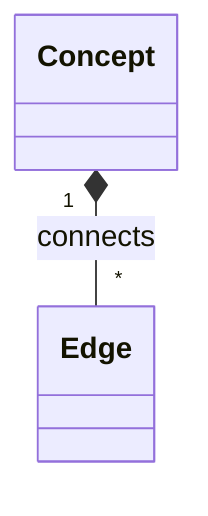

**Clarify**  
You want a *study‑map*—a knowledge graph of AI concepts—for a **Backend Engineer**.  
Assumptions:  
1. The map will be programmatic (REST/GraphQL API).  
2. Users query by concept, tag, or prerequisite chain.  
3. Data is versioned and searchable.

**Approach**  
1. Design a *graph database* schema (nodes = concepts, edges = relationships like “prerequisite_of”).  
2. Build an ingestion pipeline: scrape textbooks, papers, and course outlines → NLP → extract entities/relations → upsert into the graph.  
3. Expose CRUD + search APIs; cache hot queries in Redis.  
4. Front‑end (not required) visualises with D3 or Cytoscape.

**Depth**  
*Schema*:  

Edge types: `prerequisite_of`, `related_to`, `applied_in`.  
*API*:  
- `GET /concepts/{id}` → full node + outgoing edges.  
- `POST /edges` → add relation.  
*Complexity*:  
- Query traversal O(E) where E is edges in the path; mitigated by limiting depth or using Neo4j’s built‑in traversals (O(log N)).  
- Ingestion: NLP extraction ~O(N log N).  

**Edge Cases**  
- Cyclic prerequisites → detect & warn.  
- Duplicate concepts across sources → dedupe via canonical IDs.  
- Scalability: sharding graph on concept namespace; fallback to relational DB for audit logs.

**Optimize & Communicate**  
1. Cache most‑visited subgraphs (e.g., “Deep Learning” subtree).  
2. Use async batch writes to reduce write latency.  
3. Log query metrics to identify hot paths and pre‑compute those traversals.  

Narration: I’d start by outlining the data model, then walk through ingestion, API design, and finally address scalability and edge handling—showing clear trade‑offs (graph DB vs RDBMS) and how each decision supports a robust backend for an AI study map.

_Written by openai/gpt-oss-20b running locally. Machine-generated, not reviewed._
