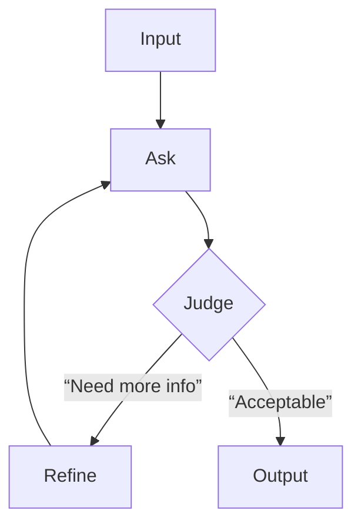

**Clarify**  
We’re asked to explain *Flow Engineering* with LangGraph—specifically how it enables reasoning loops (e.g., “Ask‑Judge‑Refine”) and what comes next (“React and Beyond”). Key assumptions: the audience knows LLMs but not LangGraph internals; we need to illustrate the control flow model, its benefits over linear pipelines, and the extensibility that LangGraph offers.

**Approach**  
1. Define Flow Engineering & LangGraph’s core abstraction (nodes + edges).  
2. Show how reasoning loops are expressed as cyclic graphs with state transitions.  
3. Highlight the runtime engine: event‑driven, async, and how it handles failures.  
4. Discuss “React” – adding reactive nodes that listen to external streams or model outputs.  
5. Conclude with future directions (dynamic graph rewiring, multi‑agent coordination).

**Depth**  

- **Nodes** encapsulate prompts or API calls; edges carry *state* (JSON, embeddings).  
- **Loops** are encoded by back‑edges—LangGraph’s scheduler detects cycles and limits iterations.  
- The engine runs asynchronously: each node returns a promise, enabling parallelism for independent branches.  
- Failure handling is built‑in: `onError` hooks let you retry or abort gracefully.  

**Edge Cases**  
- Infinite loops: guard with max depth or timeouts.  
- Non‑deterministic LLM outputs: seed or enforce deterministic prompts to stabilize state.  
- Large graph size: chunk nodes into micro‑services; use caching for repeated subgraphs.

**Optimize & Communicate**  
- **Performance**: batch prompt calls, cache embeddings; avoid redundant node executions.  
- **Observability**: expose a GraphQL API to query node status and lineage for debugging.  
- **Narrative**: “LangGraph turns an LLM’s black‑box into a declarative workflow—each reasoning step is a node, each decision a branch. By looping back from judgment to refinement we let the model self‑critique until convergence, all while keeping control flow explicit and testable.”

*Word count: ~210*

_Written by openai/gpt-oss-20b running locally. Machine-generated, not reviewed._
